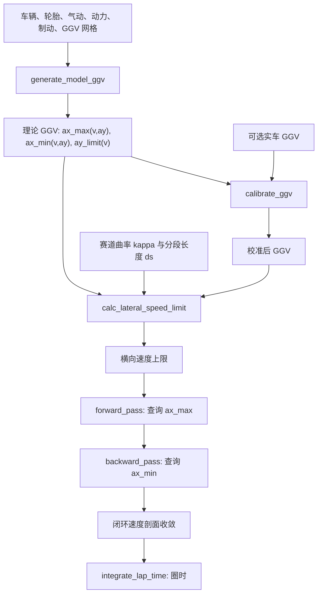

# 圈速计算对 GGV 的依赖及 GGV 参数化生成说明

## 1. 结论

本程序的圈速求解以速度相关 GGV（GGV：纵向加速度 `Ax`、横向加速度 `Ay` 与车速 `V` 的能力包络）作为车辆能力边界。对每个车速和横向加速度需求，GGV 给出：

- 最大净加速能力 `ax_max_g(v, ay)`；
- 最大净制动能力 `ax_min_g(v, ay)`，数值为负；
- 正、负横向极限 `ay_limit_pos_g(v)`、`ay_limit_neg_g(v)`；
- 该状态是否可行、主导约束、固定点收敛状态和残差。

当前理论 GGV **不是把输入参数代入经验多项式进行黑箱拟合**。它由 `generate_model_ggv` 在离散 `(v, Ay)` 网格上逐点调用车辆载荷、降阶轮胎包络、气动、动力和制动模型，求出准稳态能力边界。只有提供 `models.ggv_real` 时，程序才在理论 GGV 之上识别速度相关的横向、加速和制动比例，这一步才属于经验残差校准。

圈速计算随后用赛道曲率重建实际横向加速度

```text
ay_mps2 = v^2 * kappa
ay_g    = ay_mps2 / g
```

并在 GGV 中查询该实际 `(v, ay)` 下的 `ax_max` 或 `ax_min`，完成横向限速、前向加速传播和后向制动传播。因此，圈速不是由某个单一峰值 `g` 决定，而是依赖完整的三维速度相关能力面。

## 2. 主调用链



`run_qss_lap` 是主编排器：

1. 若 `models.ggv` 已提供，则使用预建 GGV；启用组合动力系统时还校验其 provenance 是否与当前车辆、轮胎、气动、动力、制动和选项一致。
2. 若未提供 `models.ggv`，则在线调用 `generate_model_ggv`。
3. 若提供 `models.ggv_real`，调用 `calibrate_ggv` 校准理论 GGV。
4. 使用最终 GGV 求横向限速、前向加速可达性和后向制动可达性。
5. 速度剖面收敛后积分圈时，并进行动力、能量和 limiter 后处理。

对应入口和实现文件：

- `src/core/run_qss_lap.m`
- `src/ggv/generate_model_ggv.m`
- `src/ggv/calibrate_ggv.m`
- `src/ggv/interp_ggv.m`
- `src/core/calc_lateral_speed_limit.m`
- `src/core/forward_pass.m`
- `src/core/backward_pass.m`

## 3. 哪些输入参数进入 GGV

下表按 GUI/运行时配置说明输入参数如何影响理论 GGV。所有生产接口使用 SI 单位；GGV 的加速度输出存为 `g`。

| 输入组 | 直接进入理论 GGV 的主要参数 | 作用 |
|---|---|---|
| 车辆 | `mass.total_kg`、`front_static_frac`、`cg_height_m`、`wheelbase_m`、前/后轮距、前轴横向载荷转移分配、驱动形式 | 决定静载、纵横向载荷转移、抬轴边界、驱动轮选择和单位力对应的加速度 |
| 轮胎 | `Fz_ref_N`、`mu_x_ref`、`mu_y_ref`、纵/横向载荷敏感系数、`combined_n`、`rolling_radius_m` | 决定各轮随垂向载荷变化的纵横向力上限、联合附着剩余纵向能力，以及电机转速/轮力换算 |
| 气动 | `rho_kgpm3`、`CDA_m2`、`CLA_m2`、`front_downforce_frac` | 阻力降低净纵向能力；下压力提高轮胎力容量并改变前后轴载荷分配；两者均随 `v^2` 变化 |
| 动力 | 驱动形式、总传动比、传动效率、电机峰值扭矩/功率/转速/电压和相电流参数、母线假设电压、电池/逆变器功率与电流限制、规则功率/电流/电压限制 | 在每个车速下生成可用电机扭矩和轮端驱动力候选，与驱动轮附着上限取最小值 |
| 制动 | `enabled`、机械最大减速度、总制动力上限、总制动扭矩、前制动力分配 | 与各轴剩余轮胎纵向能力共同确定 `ax_min` |
| GGV 选项 | `v_grid_mps`、`ay_grid_g`、`gravity_mps2`、固定点最大迭代数/容差/松弛因子 | 决定 GGV 覆盖范围、分辨率、单位换算和固定点求解标准 |

以下输入不直接生成当前理论 GGV：

- 赛道 `kappa_1pm` 和 `ds_m`：GGV 与赛道解耦；它们在圈速求解阶段选择 GGV 上的实际工作点。
- `vehicle.inertia.Iz_kgm2`：当前固定赛线 QSS GGV 主线未使用横摆惯量。
- 耐久圈数和安全系数：仅用于速度剖面收敛后的能量估算。
- 电池标称容量、初始/最低 SOC 和放电效率：用于耐久容量/SOC/能量后处理，不改变本圈理论 GGV。当前瞬时 GGV 使用固定 `V_bus_assumed_V`；`V_nominal_V`、`V_min_V` 不会形成随 SOC 变化的电压边界。
- 电机持续功率、持续扭矩、持续相电流：当前 GGV 使用峰值瞬时约束，未建立热模型，因此这些持续额定值不构成 GGV 硬边界。
- `motor.physical_peak_power_rpm` 和 `motor.Kv_nominal_load_rpm_per_V`：当前能力计算使用峰值功率数值、`Kv_peak_load_rpm_per_V`、`Kv_no_load_rpm_per_V` 和机械最高转速；这两个字段目前不直接改变 GGV 曲面。
- 完整 PAC2002 四轮 handling 模型：当前圈速/GGV 主线使用离线降阶轮胎包络；完整 `.tir` 仅用于独立的 YMD/Understeer 分支。

GUI 参数由 `app/qsslts_gui_state_to_runtime_config.m` 映射为上述 `vehicle`、`models` 和 `options` 结构。GUI 的 `GGV Δv` 只设置速度网格间隔；横向网格仍采用 `default_qss_options` 的默认值 `-4:0.05:4 g`。

## 4. 理论 GGV 如何由输入参数逐点生成

### 4.1 建立速度和横向加速度网格

默认网格为：

```text
v_grid_mps = 0:0.5:45 m/s
ay_grid_g  = -4:0.05:4 g
```

程序对每个速度 `v_i` 和每个横向需求 `ay_j` 求一个加速分支和一个制动分支，最终形成大小为 `Nv × Nay` 的 `ax_max_g`、`ax_min_g` 和 `feasible` 矩阵。

### 4.2 计算速度相关气动力

在每个速度点：

```text
q     = 0.5 * rho * v^2
Drag  = q * CDA
DF    = q * CLA
DF_f  = front_downforce_frac * DF
DF_r  = (1 - front_downforce_frac) * DF
```

下压力加入四轮垂向载荷；阻力从驱动力中扣除，并在制动时作为额外减速度。因此 GGV 中保存的是质心处的**净加速度能力**，不是仅由轮胎产生的力除以质量。

### 4.3 求每个速度下的横向极限

横向极限搜索先令 `ax = 0`，按当前 `Ay` 计算四轮载荷和各轮横向容量。横向裕量为：

```text
margin_Fy = sum(Fy_max_i) - m * abs(ay)
```

程序分别对正、负横向方向二分搜索 `margin_Fy = 0`，得到 `ay_limit_pos_g(v)` 和 `ay_limit_neg_g(v)`。如果 `ay_grid_g` 的外边界仍有正裕量，则将极限记为网格边界，并设置 `lateral_limit_truncated=true`，表示真实极限可能在网格之外。

### 4.4 计算四轮垂向载荷

每个可行 `(v, Ay)` 点的纵向分支都使用当前 `Ax` 估计值重算轮载。主要关系为：

```text
静态前轴载荷 = front_static_frac * m * g
静态后轴载荷 = (1 - front_static_frac) * m * g

纵向转移量 = m * ax * h_CG / wheelbase
前轴总载荷 = 静态前轴载荷 + 前轴下压力 - 纵向转移量
后轴总载荷 = 静态后轴载荷 + 后轴下压力 + 纵向转移量

前轴单侧横向转移 = front_distribution * m * ay * h_CG / track_front
后轴单侧横向转移 = (1-front_distribution) * m * ay * h_CG / track_rear
```

四轮顺序固定为 `[FL, FR, RL, RR]`。若某一轮计算载荷为负，模型在该车轴内将其饱和为零并守恒该轴总载荷，同时记录 `wheel_lift`。

### 4.5 从轮载得到轮胎力包络

当前 GUI 基线使用载荷敏感的降阶轮胎模型：

```text
mu_x(Fz) = mu_x_ref * [1 + k_x * (Fz - Fz_ref) / Fz_ref]
mu_y(Fz) = mu_y_ref * [1 + k_y * (Fz - Fz_ref) / Fz_ref]

Fx_max = mu_x(Fz) * Fz
Fy_max = mu_y(Fz) * Fz
```

总横向力需求按各轮横向容量比例分配：

```text
Fy_demand_i = m * ay * Fy_max_i / sum(Fy_max_i)
```

然后用每轮 p-norm 联合附着关系扣除横向用量：

```text
(abs(Fx_i)/Fx_max_i)^n + (abs(Fy_i)/Fy_max_i)^n <= 1
```

得到当前 `Ay` 下各轮剩余纵向能力 `Fx_available_i`。因此弯中加速/制动能力会低于直线能力，而且载荷敏感性、质心高度、轮距和前后载荷转移分配都可以改变包络形状。

### 4.6 求加速分支

驱动分支先对驱动轮的 `Fx_available_i` 求和，得到附着上限；再由车速、滚动半径和总传动比计算电机转速，并构造以下候选约束：

- 规则 TS 功率和 DC 电流；
- 电池峰值功率和 DC 电流；
- 逆变器峰值功率、DC 电流和相电流；
- 电机峰值扭矩、相电流、峰值功率、最高转速和电压包络。

最小候选电机扭矩换算为轮端驱动力，与驱动轮附着上限取最小值：

```text
Fx_drive = min(Fx_traction, Fx_powertrain)
ax_candidate = (Fx_drive - Drag) / m
```

相应的最小候选项记录为 `accel_limiter`。动力系统缺失或精确设置为 `enabled=false` 时，程序改用四轮理想轮胎纵向上限，不代表真实驱动系统。

### 4.7 求制动分支

制动分支根据前后轴剩余轮胎纵向容量和 `front_bias` 得到制动力分配上限，再与机械最大减速度、总制动力和总制动扭矩上限取最小值：

```text
Fx_brake = min(Fx_bias_limited, Fx_mechanical_limited)
ax_candidate = -Fx_brake / m - Drag / m
```

当前主线不在 GGV 制动分支中使用再生制动能力。

### 4.8 为什么需要固定点求解

加速或制动能力会改变纵向载荷转移，而轮载又改变载荷敏感轮胎容量、驱动附着和制动分配，所以存在闭环：

```text
Ax 估计 -> 纵向载荷转移 -> 四轮 Fz -> 轮胎/动力/制动能力 -> 新 Ax
```

程序分别对加速和制动分支求解：

```text
residual = ax_candidate(ax_estimate) - ax_estimate = 0
```

迭代使用割线更新；分母过小时使用 `ggv_relaxation` 松弛更新。结果同时保存：

- `solve_converged_accel`、`solve_converged_brake`；
- `solve_residual_accel_mps2`、`solve_residual_brake_mps2`；
- `wheel_lift` 和各分支 limiter。

## 5. 可选实车 GGV 残差校准

若提供 `models.ggv_real`，`calibrate_ggv` 在理论模型之上识别三个随速度变化的比例。它不是重新拟合轮胎参数，也不改变原始车辆参数。

在每个模型速度点，程序比较：

```text
横向能力：min(正向横向极限, abs(负向横向极限))
加速能力：Ay = 0 处的 ax_max
制动能力：Ay = 0 处的 abs(ax_min)
```

对应原始比例为：

```text
scale_lat(v)   = real_lat(v)   / model_lat(v)
scale_acc(v)   = real_acc0(v)  / model_acc0(v)
scale_brake(v) = real_brake0(v)/ model_brake0(v)
```

处理规则如下：

1. 仅在实车速度覆盖范围内线性插值；覆盖外比例保持 `1`。
2. 对有效比例做移动平均，默认窗口为 `3` 个速度点。
3. 将比例限制在默认 `[0.5, 1.2]` 范围内。
4. `scale_lat` 通过映射 `Ay/scale_lat` 变形横向轴；`scale_acc` 和 `scale_brake` 分别缩放加速面和制动面。

Sensitivity/DOE 必须只用 baseline 理论 GGV 与对应实车 GGV 识别一次比例表，再把该比例表冻结应用到每个重新生成的理论 case。若每个 case 都重新对同一实车数据拟合，校准会抵消待研究参数的物理敏感性。

## 6. 圈速求解如何消费 GGV

### 6.1 横向速度上限

对每个赛道节点，程序根据曲率方向选择正或负横向极限，并二分求解：

```text
ay_capacity_g(v) - v^2 * abs(kappa) / g = 0
```

得到 `v_lateral_limit_mps`。直线或在最高查询速度仍有横向裕量的节点由 `v_max_mps`/GGV 最高速度限制。

### 6.2 前向加速传播

在节点 `i`，程序计算实际 `Ay`，通过 `interp_ggv` 查询 `ax_max`，再用空间域运动学关系限制下一节点速度：

```text
v_(i+1)^2 <= v_i^2 + 2 * ax_max(v_i, ay_i) * ds_i
```

程序还在段入口和段中平均速度重复查询 GGV，并迭代候选出口速度，避免把入口处能力当作整段恒定能力。启用组合动力系统时，段中还直接重算固定母线电压下的 TSAC 功率上限，以降低速度网格线性插值造成的非保守误差。

### 6.3 后向制动传播

从后向前逐段查询当前节点实际 `(v, Ay)` 下的 `ax_min`：

```text
v_i^2 <= v_(i+1)^2 - 2 * ax_min(v_i, ay_i) * ds_i
```

由于 `ax_min < 0`，该式给出为满足下一节点速度所允许的最大入口速度。

### 6.4 闭环收敛和圈时积分

闭环赛道显式包含 `N -> 1` 段。前向和后向传播迭代到速度剖面最大变化不超过 `solver_tolerance_mps`。收敛后每段采用平均速度形式积分：

```text
dt_i = 2 * ds_i / (v_i + v_(i+1))
lap_time = sum(dt_i)
```

最终结果中的 `result.ggv_used` 是本次实际使用的理论、预建或校准后 GGV；`result.ax_mps2`、`result.ay_mps2` 可叠加到三维 GGV 曲面上检查整圈工作点。

## 7. 参数变化如何传递到圈速

几个典型因果链如下：

- `mu_y_ref` 提高：横向轮胎容量提高 -> `ay_limit(v)` 增大 -> 弯道横向速度上限可能提高 -> 圈时可能降低。
- `mu_x_ref` 提高：剩余纵向附着提高 -> 低速加速或制动能力可能提高；若动力/制动硬件已先达到上限，圈时可能不敏感。
- 质量提高：相同轮胎/动力的单位质量加速度通常下降，同时载荷敏感轮胎的工作载荷改变；气动下压力相对车重的收益也降低。
- 质心高度提高：纵横向载荷转移增大；在载荷敏感轮胎和固定驱动/制动分配下，通常会压缩部分 GGV，但方向和幅度必须由实际模型计算。
- `CLA` 提高：高速下压力增加 -> 高速横向和轮胎纵向容量提高；同时不会直接增加阻力，除非 `CDA` 也改变。
- `CDA` 提高：净加速能力降低、松油门减速度增大；对加速段通常不利。
- 总传动比改变：同时改变轮端扭矩和电机转速；可能改善低速驱动力，也可能更早触发电机转速/电压限制。
- TSAC 80 kW 等功率上限降低：主要压缩中高速 `ax_max(v, ay)`；横向极限本身通常不直接改变。

“参数增大一定让圈速变快/变慢”只有在主导约束未切换时才成立。应结合 `accel_limiter`、`brake_limiter`、`result.limiter` 和 `result.active_constraints` 判断实际生效路径。

## 8. 建议的检查方法

可运行在线生成理论 GGV 的演示示例：

```matlab
project_setup;
run("examples/run_qss_emrax228_hvcc_energy_demo.m");
```

也可在获得 `result` 后检查：

```matlab
ggv = result.ggv_used;
feasible = ggv.feasible;

allAccelConverged = all(ggv.solve_converged_accel(feasible), "all");
allBrakeConverged = all(ggv.solve_converged_brake(feasible), "all");
maxAccelResidual = max(abs(ggv.solve_residual_accel_mps2(feasible)));
maxBrakeResidual = max(abs(ggv.solve_residual_brake_mps2(feasible)));
hasTruncatedLateralSearch = any(ggv.lateral_limit_truncated, "all");
hasWheelLift = any(ggv.wheel_lift(feasible), "all");
```

至少应检查：

- GGV 覆盖速度不低于目标最高速度，横向网格没有意外截断；
- 所有可行网格点的加速/制动固定点均收敛，残差不超过配置容差；
- 是否出现非预期抬轮；
- GGV 网格加密后圈时变化是否满足项目门槛；
- 整圈实际 `(v, Ay, Ax)` 是否处于 GGV 可行域内；
- 主导 limiter 是否符合车辆配置和工程预期。

## 9. 适用边界与重要限制

1. `result.solver.converged` 当前只表示前后向速度传播收敛，不自动证明每个 GGV 固定点都收敛；必须单独检查 `result.ggv_used.solve_converged_*` 和残差。
2. `apply_ggv_calibration_scales` 是对能力面的比例变形，不会重新运行电机扭矩、相电流、轮力、轮速、电压和轮胎硬约束。校准比例放大后的 GGV 不能仅凭 `solver.converged` 视为硬件约束已重新验证。
3. 当前 GGV 是固定赛线准稳态能力模型，不包含驾驶员延迟、轮胎松弛、瞬态横摆/俯仰/侧倾、热衰减、SOC 对母线电压的动态反馈或自由赛线优化。
4. 当前降阶轮胎参数若不是由真实轮胎试验数据辨识，只能支持概念设计和相对方案筛选，不能据此声明绝对实车圈时精度。
5. 实车 GGV 校准只识别三个速度相关比例，不等价于完成轮胎、气动、动力或整车参数的物理辨识。

因此，GGV 生成与圈速求解通过当前回归测试时，可说明软件链路按既定模型工作；工程签核还需要真实参数来源、实车/台架数据校准、网格与约束复核以及独立验证。
